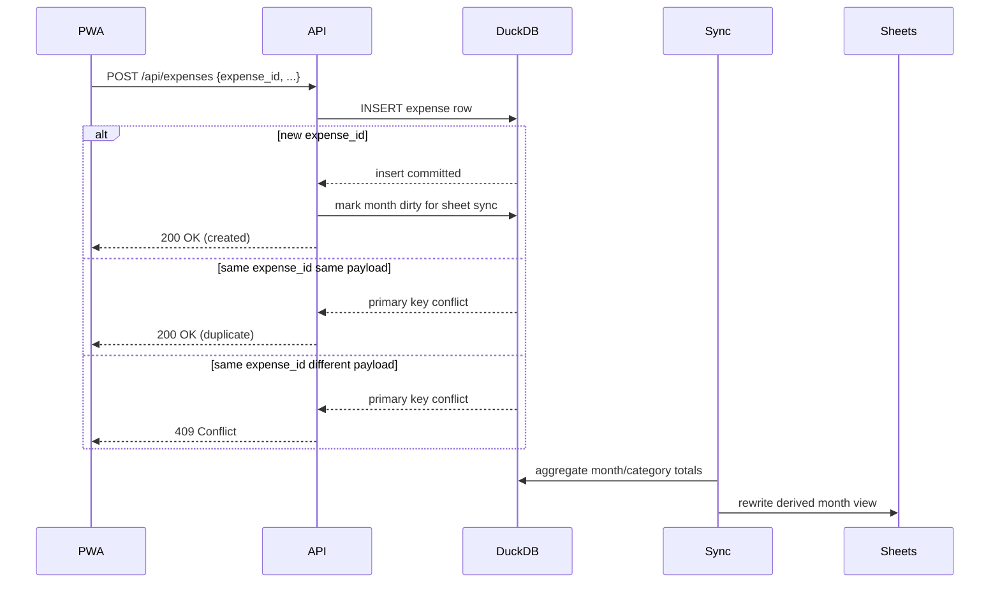

# Phase 1: DuckDB Foundation, Idempotent Ingestion, Export-Only Sheets ✓ IMPLEMENTED (3D reset, 2026-04)

> **Superseded twice.** This document is a historical plan, frozen as of the
> Phase 1 3D reset. A follow-up **single-file reset** (also 2026-04)
> landed afterwards and changed more of the design than this file
> describes: the multi-file layout (`config.duckdb` + per-year
> `budget_YYYY.duckdb`) was collapsed into a single `data/dinary.duckdb`,
> the global `expense_id_registry` table was removed and idempotency
> moved to a `client_expense_id` UUID with a plain `UNIQUE` constraint,
> `POST /api/expenses` no longer echoes the server-side expense id,
> and `inv import-catalog` became FK-safe (toggles `is_active` instead
> of wiping catalog rows). A subsequent refinement split the currency
> model into `settings.app_currency` (PWA display / input, default
> `RSD`) and `settings.accounting_currency` (DB storage + reports,
> default `EUR`); `expenses.amount` and `income.amount` are now both
> in the accounting currency. For the current architecture see
> [`.plans/architecture.md`](architecture.md). Treat everything below as
> historical reference.
>
> It still uses the pre-rename names
> (`sheet_sync_jobs`, `inv sync`, `schedule_sync`,
> `sheet_import_sources`, `sheet_mapping`, `sheet_mapping_tags`,
> `import_sheet`). Do not edit names here in-place — they document the
> as-shipped state at the time of the 3D reset, not the current
> post-single-file-reset codebase.
>
> **Operational warning:** The command names in this file are also frozen.
> In the current codebase there is no `inv sync` alias; the
> `inv drain-logging` CLI was removed and replaced by the in-process
> periodic drain inside the FastAPI process — there is no current CLI
> to invoke. The runtime queue is now `sheet_logging_jobs`, and the
> current implementation is append-only single-row logging — not the
> older full-month rebuild model described below.
>
> **Schema warning (post-file-backed-import-sources reset, 2026-04):**
> every mention of `sheet_import_sources` / `import_sources` below
> refers to a **DuckDB table that no longer exists**. The per-year
> source registry is now an operator-local, gitignored JSON file at
> `.deploy/import_sources.json`, loaded by
> `dinary.config.read_import_sources`. Where this document says
> "row in `sheet_import_sources`", the current equivalent is an entry
> in that JSON array; where it says "latest configured sheet year",
> the current equivalent is `max(r.year for r in read_import_sources()
> if r.year > 0)`. See [`.plans/architecture.md`](architecture.md)
> and the repo-root `imports/` directory for the live design.
>
> **Status note:** Phase 1 was reset from the originally-shipped 4D model (`category`, `beneficiary`, `event`, `sphere_of_life`) to the **3D model** (`category`, `event`, `tag_ids[]`) plus an export-only Google Sheets contract. The "Current state" section below captures the post-reset design as it stood when this document was frozen, but it still uses the original pre-rename terminology. Treat the entire file as historical reference, not as current documentation.

## Goal

Move from Phase 0 (direct Google Sheets writes) to a DuckDB-backed architecture:

- **DuckDB is the source of truth.** Google Sheets are export-only from Phase 1 onward; historical sheet import is a one-shot bootstrap.
- **Idempotency is enforced at the database layer** via `expenses.id PRIMARY KEY` plus a global cross-year `expense_id_registry` so the same UUID cannot land in two different yearly DB files.
- **PWA never blocks on Google API**: `POST /api/expenses` enqueues `sheet_sync_jobs(expense_id)` in the same DuckDB transaction and returns; an `asyncio` worker performs the single-row append outside the request cycle, with `inv sync` as the durable retry path.

This is replay protection (retry of the same queued item, timeout retries, same `expense_id` from another device). Semantic dedup (user enters the same purchase twice with different IDs) is out of scope for Phase 1.

## Frozen snapshot (post-3D-reset, 2026-04)

> Historical snapshot only: the sections below preserve the design as this
> document described it at the time it was frozen, including obsolete command
> names like `inv sync` / `sheet_sync_jobs`. Do not execute commands from this
> section. For the runnable operator workflow use [`.plans/architecture.md`](architecture.md)
> and `tasks.py`.

### Dimensional model: 3D

The implemented model has three orthogonal dimensions:

1. `category` — what was bought (from the fixed taxonomy in [docs/src/ru/taxonomy.md](../docs/src/ru/taxonomy.md), authoritative source: [src/dinary/services/seed_config.py](../src/dinary/services/seed_config.py)).
2. `event` — bounded context (trips, camps, business trips, relocation). One event per expense (nullable). In Phase 1 only the historical sheet import originates `event_id`; the PWA stores `event_id=NULL`.
3. `tag_ids[]` — flat many-to-many flags. Replaces both the former `beneficiary` and `sphere_of_life` axes. Phase-1 dictionary is fixed in `seed_config.PHASE1_TAGS` and hardcoded in the PWA.

Dropped vs. earlier 4D Phase-1 implementation:

- `beneficiary` and `sphere_of_life` as first-class axes — collapsed into the flat tag dictionary.
- `store` — never re-introduced.

The PWA contract is intentionally narrow: `expense_id` (UUID), `category_id`, optional `tag_ids[]`, plus `datetime` / `amount` / `amount_original` / `currency_original` / `comment`. Sending `event_id` from the client is rejected with 4xx.

### Catalog versioning

`config.duckdb.app_metadata.catalog_version` is monotonic. The only Phase-1 bump path is `inv import-catalog` (previous + 1 after wipe + reseed). `GET /api/categories` and `POST /api/expenses` echo the current value so the PWA can opportunistically invalidate the cached category list.

### Currency model

- All amounts are stored in **EUR** in `expenses.amount`.
- `amount_original` + `currency_original` preserve the original value for audit.
- Historical conversion uses the NBS (National Bank of Serbia) middle rate on the 1st of the expense month. The cache lives in `config.duckdb.exchange_rates`.
- **Frankfurter fallback**: NBS has no RUB rates before Dec 2012. `get_rate` falls back to Frankfurter (ECB historical) for the missing currency, then bridges via NBS `EUR → RSD`. Implemented in [src/dinary/services/nbs.py](../src/dinary/services/nbs.py).

### Historical data import (bootstrap-only)

Historical data migration is **bootstrap-only and operator-driven**. The `import_sheet.py` codepath is reused exclusively by `inv import-budget`; the standalone `inv import-sheet` operator workflow has been retired.

- `sheet_import_sources` (in `config.duckdb`) maps each year to its spreadsheet ID, worksheet name, and layout key.
- `SheetLayout` (in [src/dinary/imports/expense_import.py](../src/dinary/imports/expense_import.py); the module was named `src/dinary/services/import_sheet.py` when this doc was written) describes column positions for each historical sheet generation (`default`, `rub`, `rub_fallback`, `rub_6col`, `rub_2016`, `rub_2014`, `rub_2012`).
- Bootstrap import resolves each legacy `(year, sheet_category, sheet_group)` row through `sheet_mapping` (exact-year row first, then year=0 fallback), pulls `category_id`, `event_id`, and the tag set from `sheet_mapping_tags`, generates a fresh UUID4 per row, and writes both `expenses` and `expense_tags`. Imported rows populate `sheet_category` / `sheet_group` together as audit provenance (with `sheet_group=''` when the legacy row had no envelope); runtime rows leave both NULL.
- `inv import-verify-bootstrap --year=YYYY` validates that DB rows match the resolved 3D mapping for the bootstrap-imported set. The coordinated reset flow loops verification across every rebuilt year.

### Sheet write model: persistent queue + async worker

From Phase 1 onward Google Sheets are export-only. The write model is:

- `sheet_sync_jobs(expense_id, status, claim_token, claimed_at)` in each `budget_YYYY.duckdb` is the durable queue. The in-process async task is just an opportunistic fast path over that queue.
- Producer: `POST /api/expenses` inserts the queue row in the same DuckDB transaction as the `expenses` row.
- Consumers (both run the same `_sync_single_row` code path):
  - async worker spawned by `asyncio.create_task` right before the API returns, only on the fresh-insert path that also created the queue row;
  - `inv sync`, which iterates every `sheet_sync_jobs` row across all `budget_*.duckdb` files and re-runs the same single-row append, including stale `in_progress` rows past the claim timeout.
- Atomic claim: workers must transition the row from `pending` to `in_progress` with a unique `claim_token` and fresh `claimed_at` before appending. If the claim fails (row absent, already claimed and not stale), the worker no-ops. On success the row is deleted; on failure after claim, the row is released back to `pending`.
- No full-month rebuild, no DB-to-sheet reconciliation.

### Forward-projection rules

The async worker maps `(category_id, event_id, tag set)` to a target `(sheet_category, sheet_group)` row in **the latest configured sheet year only** — never `YEAR(expense.datetime)`. The latest configured sheet year is `MAX(sheet_import_sources.year > 0)`. Lookup order:

1. exact match on `category_id`, `event_id` (NULL matches NULL), and tag-id set;
2. fallback: first `sheet_mapping` row with the same `category_id` (tag set / `event_id` ignored);
3. ties resolved by `sheet_mapping.id ASC`.

Hard invariants (seed/verification fail loudly otherwise): at least one positive year in `sheet_import_sources`; the latest-year row is a valid expense-append target (`spreadsheet_id`, `worksheet_name`, supported `layout_key`); the latest year has a `sheet_mapping` row for every category exposed by `GET /api/categories`.

This is best-effort placement into existing latest-year rows, not a round-trip guarantee. Re-importing a runtime row later may recover only an approximation of the original 3D tuple. That is accepted because post-bootstrap reverse import is not an operational goal.

### Operational workflow

> Historical workflow only: the commands quoted in this section are preserved
> verbatim for context. In the current codebase use `inv import-catalog`,
> `inv import-budget-all`, `inv import-income-all`,
> `inv import-verify-bootstrap-all`, `inv import-verify-income-all`, and
> `inv drain-logging`.

1. `inv backup` — rsyncs `data/` from the server to the operator's laptop.
2. **Coordinated full reset (destructive, requires `--yes`)** — keep the server stopped for the entire flow:
   1. deploy code/assets via the no-restart deploy path;
   2. `inv import-catalog --yes` (preserves and bumps `catalog_version` to `previous + 1`);
   3. `inv import-budget-all --yes` (also wipes any `sheet_sync_jobs` rows in those files);
   4. `inv import-income-all --yes`;
   5. `inv import-verify-bootstrap-all` and `inv import-verify-income-all`;
   6. start server.
3. `inv sync` — re-runs the single-row append for every `sheet_sync_jobs` row across all `budget_*.duckdb` files. Used after process crashes, transient Google API failures, or manual recovery.

The destructive commands print loud warnings and do nothing without `--yes`. Running `inv import-catalog` alone leaves existing `budget_YYYY.duckdb` files temporarily inconsistent with the reseeded catalog until `import-budget-all` is rerun; the operator workflow only supports the full coordinated reset (or a fresh empty setup).

---

# Historical design intent (pre-3D-reset)

The sections below preserve the original 5D / 4D Phase-1 design rationale for context. They contradict the current schema, mapping table, API contract, and sync model in many places. Where they disagree with [`.plans/architecture.md`](architecture.md) or with the code in [src/dinary/services/seed_config.py](../src/dinary/services/seed_config.py), the current code wins.

## Target flow



## Recommended Phase 1 scope

This plan keeps Phase 1 focused on the **current manual-entry MVP** while preparing for the fuller architecture later.

- Manual entry remains the only production write path.
- QR flow still only extracts total + date.
- **DuckDB uses the full 5-dimensional classification** from [architecture.md](architecture.md) (category, beneficiary, event, tags, store) from day one.
- A **sheet-to-5D mapping table** translates the flat Google Sheet categories into the 5D model on ingestion.
- **PWA is unchanged** -- it still sends `(category, group)` as in Phase 0. The server resolves these to 5D via the mapping table.
- Google Sheets is maintained by a sync layer that projects 5D data back into the sheet's flat `(category, group)` format using the same mapping table in reverse.

### What Phase 1 does NOT include

Historical data migration, receipt parsing, AI classification, native 5D UI -- see [architecture.md](architecture.md) for later phases. After cutover, DuckDB contains only new expenses; Google Sheets retains all historical data as-is.

## Implementation

### Step 0: Prove the current code creates duplicates

Before changing production code, add tests that demonstrate the duplication problem using the **current API and storage layer**. These tests are storage-agnostic: they do not reference DuckDB, `expense_id`, or any Phase 1 concept. They test observable behavior through the existing `/api/expenses` endpoint and the existing JS queue contract.

These tests **fail now** (i.e. they assert "no duplicate" but the current code creates one). They will **pass after Phase 1** because dedup is implemented -- not because we switched storage engines.

#### Python: server-side duplication

File: [tests/test_api.py](../tests/test_api.py)

Epic: `Data Safety`, Feature: `Deduplication`

- `test_identical_expense_submitted_twice_creates_one_entry` -- POST the same expense data twice in sequence; assert the resulting storage contains the amount only once for that `(month, category, group)`.
- `test_retry_after_successful_write_does_not_double_count` -- simulate the scenario where POST succeeds, but the client retries (as if `remove()` failed); assert the total for that category does not double.

These tests use the current API contract (no `expense_id` field) and mock at the `gspread.Worksheet` level (replace the actual Google Sheets calls with an in-memory fake that records writes). This lets the tests exercise the real API handler and `sheets.py` logic while avoiding network calls. They fail because the current code unconditionally appends on every call.

**Important nuance:** In Phase 0 the append-on-every-call behavior is by design -- each POST adds a receipt amount to a running formula in the spreadsheet. These tests are not claiming Phase 0 has a bug. They document the **Phase 1 contract** (idempotent ingestion) and prove it is not satisfied by the current implementation. They will pass after Phase 1 not because a bug was fixed, but because the storage model changed to one where idempotency is natural.

#### JavaScript: client-side dedup contract

File: [tests/js/no-data-loss.test.js](../tests/js/no-data-loss.test.js)

Epic: `Data Safety`, Feature: `Deduplication`

- `test_enqueue_generates_stable_identity` -- enqueue an expense, read it back; assert it has a field that can serve as a stable retry key (currently absent, so the test fails).
- `test_flush_sends_identity_to_server` -- mock `postFn`, flush an enqueued item; assert the POST body includes a stable identity field (currently absent, so the test fails).

These tests are about the *contract* ("each queued expense must have a stable identity"), not about the implementation mechanism. They fail now because `enqueue()` does not generate any identity field.

#### Phase 1 specific tests (added later, not in Step 0)

Tests that are inherently tied to DuckDB, year routing, sync projection, category-from-DB, and the `409` mismatch path are **not** part of Step 0. They are added alongside their respective implementation steps (Steps 1-5) because they cannot meaningfully run against the current codebase at all.

### Step 1: DuckDB bootstrap and schema

Add the persistence layer for:

- `data/config.duckdb` -- 5D classification metadata and sheet mapping
- `data/budget_YYYY.duckdb` -- yearly transactional data

Phase 1 uses the **full 5-dimensional schema** from [architecture.md](architecture.md) from day one, not a simplified subset. This avoids a painful mid-life migration from flat to 5D.

#### In `config.duckdb`

```sql
CREATE TABLE category_groups (
    id          INTEGER PRIMARY KEY,
    name        TEXT NOT NULL UNIQUE,
    monthly_budget_eur DECIMAL(10,2)
);

CREATE TABLE categories (
    id          INTEGER PRIMARY KEY,
    name        TEXT NOT NULL,
    group_id    INTEGER NOT NULL REFERENCES category_groups(id),
    UNIQUE(name, group_id)
);

CREATE TABLE family_members (
    id          INTEGER PRIMARY KEY,
    name        TEXT NOT NULL UNIQUE
);

CREATE TABLE events (
    id          INTEGER PRIMARY KEY,
    name        TEXT NOT NULL,
    date_from   DATE NOT NULL,
    date_to     DATE NOT NULL,
    is_active   BOOLEAN DEFAULT true,
    comment     TEXT
);

CREATE TABLE event_members (
    event_id    INTEGER NOT NULL REFERENCES events(id),
    member_id   INTEGER NOT NULL REFERENCES family_members(id),
    PRIMARY KEY (event_id, member_id)
);

CREATE TABLE tags (
    id          INTEGER PRIMARY KEY,
    name        TEXT NOT NULL UNIQUE
);

CREATE TABLE stores (
    id          INTEGER PRIMARY KEY,
    name        TEXT NOT NULL UNIQUE,
    store_type  TEXT
);
```

Categories with "no group" in the current sheet do **not** use `NULL`. Instead `category_groups` contains a dedicated row with `name=''` (empty string), and those categories reference that row via a normal non-null `group_id`. This avoids SQL uniqueness ambiguity around nullable columns.

**Note on divergence from architecture.md:** The architecture schema has `categories.name UNIQUE` (globally unique names) and nullable `group_id`. Phase 1 intentionally uses `UNIQUE(name, group_id)` with `NOT NULL group_id` instead, because the current sheet has categories that share names across groups. Architecture.md should be updated to match when Phase 1 is complete.

##### Sheet-to-5D mapping table

The current Google Sheet uses a flat `(Расходы, Конверт)` pair that mixes several orthogonal concepts in a single "envelope" column: category groups (здоровье), beneficiaries (собака, ребенок, лариса), tags (релокация, профессиональное), and event-like contexts (путешествия).

The mapping table decomposes each sheet pair into the proper 5D assignment:

```sql
CREATE TABLE sheet_category_mapping (
    sheet_category  TEXT NOT NULL,
    sheet_group     TEXT NOT NULL DEFAULT '',
    category_id     INTEGER NOT NULL REFERENCES categories(id),
    beneficiary_id  INTEGER REFERENCES family_members(id),
    event_id        INTEGER REFERENCES events(id),  -- NULL for путешествия (resolved dynamically by expense date)
    store_id        INTEGER REFERENCES stores(id),
    tag_ids         INTEGER[],
    PRIMARY KEY (sheet_category, sheet_group)
);
```

Example mappings (illustrative -- `group_name` and `notes` are not SQL columns, they show which `category_groups` row is involved):

| sheet_category | sheet_group | -> category (group_name) | -> beneficiary | -> event | -> tag_ids | notes |
|---|---|---|---|---|---|---|
| еда&бытовые | собака | еда&бытовые (питание) | собака | | | envelope = beneficiary |
| карманные | ребенок | карманные (—) | Аня | | | envelope = beneficiary |
| булавки | лариса | булавки (—) | Лариса | | | envelope = beneficiary |
| обустройство | релокация | обустройство (жильё) | | | [релокация] | envelope = tag |
| обучение | профессиональное | обучение (—) | | | [профессиональное] | envelope = tag |
| топливо | путешествия | топливо (транспорт) | | *(resolved by date)* | | event resolved dynamically |
| кафе | путешествия | кафе (питание) | | *(resolved by date)* | | event resolved dynamically |
| медицина | здоровье | медицина (здоровье) | | | | envelope = category group |
| еда&бытовые | | еда&бытовые (питание) | | | | no envelope |
| одежда | | одежда (—) | | | | no envelope |
| мобильник | | мобильник (—) | | | | no envelope |

The actual `sheet_category_mapping` rows contain only integer IDs (`category_id`, `beneficiary_id`, `store_id`, `event_id`, `tag_ids[]`), not human-readable names. The names above are for readability.

The "путешествия" envelope in the current sheet **is** mapped to `event_id` via date-range matching, not a static mapping column. For each operational year, a synthetic event `отпуск-YYYY` is created in `events` with `date_from = YYYY-01-01`, `date_to = YYYY-12-31`. During forward mapping, if `sheet_group = "путешествия"`, the server finds the event whose `date_from..date_to` range contains the expense date and sets that `event_id`. The `event_id` column in `sheet_category_mapping` is `NULL` for `путешествия` rows -- the event is resolved dynamically, not stored in the mapping table.

During reverse mapping (sync), the same logic applies in reverse: the sync layer matches the expense's `event_id` back to a `путешествия` mapping row by checking that the expense has an `event_id` corresponding to a synthetic travel event.

The mapping table is used in two directions:

- **Ingestion (forward)**: PWA sends `(category, group)` -> server looks up mapping -> stores expense with full 5D in DuckDB
- **Sync (reverse)**: server reads 5D expense from DuckDB -> reverse-looks up the mapping -> writes to the correct `(category, group)` row in the sheet

#### In `budget_YYYY.duckdb`

```sql
CREATE TABLE expenses (
    id              TEXT PRIMARY KEY,
    datetime        TIMESTAMP NOT NULL,
    name            TEXT NOT NULL DEFAULT '',
    amount          DECIMAL(10,2) NOT NULL,
    currency        TEXT DEFAULT 'RSD',
    -- dimension IDs reference config.duckdb tables; no REFERENCES clause
    -- because DuckDB cannot enforce cross-database FKs.
    -- Integrity is validated in SQL against ATTACHed config tables
    -- (see "Cross-database referential integrity" section).
    category_id     INTEGER NOT NULL,
    beneficiary_id  INTEGER,
    event_id        INTEGER,
    store_id        INTEGER,
    comment         TEXT,
    source          TEXT NOT NULL DEFAULT 'manual'
);

CREATE TABLE expense_tags (
    expense_id  TEXT NOT NULL REFERENCES expenses(id),  -- same DB, FK works
    tag_id      INTEGER NOT NULL,  -- validated in SQL against ATTACHed config.tags
    PRIMARY KEY (expense_id, tag_id)
);

CREATE TABLE sheet_sync_jobs (
    year    INTEGER,  -- redundant with the DB filename, but kept so each
    month   INTEGER,  -- row is self-describing and inv sync needs no filename parsing
    PRIMARY KEY (year, month)
);
```

`name` defaults to `''`. Manual entry has no item-name field -- the PWA sends only `(amount, category, group, comment, date)`. The server stores `name = ''` for manual entries.

`category_id` is `NOT NULL` because the only write path is manual entry via the PWA, where the user always selects a category.

The `source` column distinguishes how the expense was created:

- `'manual'` -- entered by the user via PWA (default, all Phase 1 live data)
- `'legacy_import'` -- reserved for future historical data migration

**Columns deferred from the architecture schema:** The `expenses` table omits `quantity`, `unit_price`, `receipt_id`, `ai_category_suggestion`, and `classification_status` -- they have no source in manual-entry-only mode. They will be added via `ALTER TABLE ADD COLUMN` in later phases. DuckDB supports this on tables with existing data; new columns default to `NULL` for old rows.

Tables not needed in Phase 1 (`receipts`, `income`, `exchange_rates`, `category_rules`) are deferred to their respective phases but the schema is forward-compatible.

Tags use two representations for different purposes:

- `sheet_category_mapping.tag_ids` is the forward-mapping source: a canonical sorted array of tag IDs attached to a `(sheet_category, sheet_group)` pair.
- `expense_tags` is the normalized transactional representation for stored expenses.

Whenever the service or sync logic needs "expense tags as a set", it must derive a canonical sorted `tag_ids` array from `expense_tags` (e.g. `list(tag_id ORDER BY tag_id)`). This derived array is what is compared against `sheet_category_mapping.tag_ids`.

#### Year routing

The architecture is explicitly year-partitioned, so the repository layer must route every write and read by `expense_date.year`.

Required behavior:

- `POST /api/expenses` for `2026-12-31` uses `data/budget_2026.duckdb`
- `POST /api/expenses` for `2027-01-01` uses `data/budget_2027.duckdb`
- the server auto-creates a yearly DB file on first use if it does not exist yet
- tests must cover year boundary routing

Dedup is enforced by the database engine (`expenses.id PRIMARY KEY`), not by application code scanning spreadsheet cells.

#### Cross-database referential integrity

`expenses.category_id`, `beneficiary_id`, `event_id`, `store_id` reference tables in `config.duckdb`, but `expenses` lives in `budget_YYYY.duckdb`. DuckDB cannot enforce declarative foreign keys across attached databases. Instead, the repository layer uses `ATTACH 'data/config.duckdb' AS config (READ_ONLY)` when opening a yearly DB connection, and validates dimension IDs via SQL `EXISTS` checks against the attached config tables (e.g. `WHERE EXISTS (SELECT 1 FROM config.categories WHERE id = :category_id)`). This keeps validation logic in SQL rather than in application code, and `ATTACH` does not load the file into memory -- data is read from disk on demand.

### Step 2: Import 5D reference data and build sheet mapping

Current code validates categories against Google Sheets. Phase 1 switches to DuckDB and simultaneously establishes the full 5D classification.

#### 2a: Populate 5D reference tables

From the current Google Sheet's category/group structure, populate all five dimension tables in `config.duckdb`:

1. **category_groups** and **categories** -- extracted from the sheet's unique `(Расходы, Конверт)` pairs, decomposing them into proper categories and groups. For example, "медицина" in envelope "здоровье" becomes category "медицина" in group "здоровье".
2. **family_members** -- extracted from envelopes that are actually beneficiaries: "собака", "ребенок" (→ Аня), "лариса" (→ Лариса), plus the default "семья".
3. **tags** -- extracted from envelopes that are cross-cutting flags: "релокация", "профессиональное".
4. **stores** -- initially empty.
5. **events** -- create synthetic travel event `отпуск-YYYY` for each operational year (`date_from = YYYY-01-01`, `date_to = YYYY-12-31`). At bootstrap, create one for the cutover year. New yearly events are auto-created when a `путешествия` expense arrives for a year that has no travel event yet.

#### 2b: Populate sheet_category_mapping

For every unique `(Расходы, Конверт)` pair in the current sheet, create a mapping row that decomposes it into the 5D dimensions. This is a one-time manual/semi-automated step -- the operator reviews and confirms each mapping because the sheet's envelope column mixes dimensions in ways that only a human can correctly interpret.

#### 2c: Switch API reads to DuckDB

Change:
- `GET /api/categories` -- reads from `config.duckdb`, returns the flat `(category, group)` list that the PWA expects (the PWA is unchanged)
- category validation in `/api/expenses` -- validated via `ATTACH`ed config tables in SQL (see "Cross-database referential integrity")

The important rule is: after cutover, `GET /api/categories` and category validation never read from Google Sheets again.

#### Category workflow after cutover

Once Google Sheets becomes a derived view, editing categories in the sheet must stop being an operational workflow.

For the first Phase 1 cut, the category source-of-truth workflow should be:

- one-time import from the current Google Sheet into `config.duckdb`
- afterwards categories and mappings are managed in DuckDB only
- operationally, reference data edits happen via a dedicated **invoke task backed by a local server-side admin script**, not by editing the spreadsheet

The plan does **not** require building a full category-management UI in this phase. The chosen operational model is:

- a local admin script that reads/writes `config.duckdb` (all 5D tables + mapping)
- an `inv` task wrapping that script for operator use

#### Reference data identity and mutation rules

Once reference entities have integer IDs, renaming or reassignment needs explicit rules to keep historical expenses valid:

- **Rename** (category, group, family member, tag): update the name in place. IDs on existing expenses stay unchanged, so historical data retroactively reflects the new name. Acceptable at current scale.
- **Delete**: disallowed if any `expenses` row references the entity. The admin script must enforce this check.
- **Merge**: reassign all referencing `expenses` rows from the deprecated entity to the surviving one, then delete the deprecated entity.
- **Mapping change**: updating `sheet_category_mapping` affects only future ingestion and sync. Existing DuckDB rows keep their stored 5D assignment.
- **5D uniqueness invariant**: for non-travel mapping rows (where `event_id` is not NULL or `sheet_group != 'путешествия'`), no two rows may have the same `(category_id, beneficiary_id, event_id, store_id, sorted tag_ids)` using null-safe comparison. For `путешествия` rows (`event_id = NULL`, event resolved dynamically), uniqueness is already guaranteed by the PK `(sheet_category, sheet_group)` -- each category appears at most once within `путешествия`. The admin script must enforce both constraints on every insert/update and reject violations.

### Step 3: Make `/api/expenses` idempotent through DuckDB

In [src/dinary/api/expenses.py](../src/dinary/api/expenses.py):

- require `expense_id: str = Field(min_length=1)`
- keep `amount`, `category`, `group`, `comment`, `date` (PWA unchanged)
- look up `(category, group)` in `sheet_category_mapping` to resolve the full 5D assignment: `category_id`, `beneficiary_id`, `event_id`, `store_id`, `tag_ids`. If no mapping row exists for the submitted `(category, group)`, return **422 Unprocessable Entity** with a message identifying the unknown pair. This is the same validation gate as Step 2c's category validation -- the mapping table is the single source of valid `(category, group)` pairs.
- insert the expense into DuckDB with all 5 dimensions populated
- call a DuckDB repository/service instead of `sheets.write_expense()`

#### Response contract for created vs duplicate

Phase 1 should make duplicate semantics explicit in the API response instead of silently overloading the current Phase 0 response shape.

Recommended response model:

```python
class ExpenseResponse(BaseModel):
    status: Literal["created", "duplicate"]
    expense_id: str
    month: str
    category: str
    amount_rsd: float
```

Rules:

- first successful insert returns `status="created"`
- duplicate request for the same `expense_id` returns `status="duplicate"`
- HTTP status remains `200` in both cases
- if the same `expense_id` is resent with a different payload (`amount`, `category/group`, `date`, `comment`, or resolved `category_id`), treat it as a client/data-corruption bug and return **409 Conflict**

This makes idempotency observable and avoids ambiguity about whether the client is seeing a first write or a replay.

Recommended service behavior:

1. begin DB transaction
2. `INSERT INTO expenses ... ON CONFLICT (client_expense_id) DO NOTHING RETURNING id`
3. check if `RETURNING` produced a row:
  - if a row was returned (insert succeeded):
    - insert rows into `expense_tags` for each resolved `tag_id` (same transaction)
    - upsert `(year, month)` into `sheet_sync_jobs`
    - commit
    - return `ExpenseResponse(status="created", ...)`
  - if no row returned (PK already exists):
    - `SELECT` the existing row by `id`
    - derive `sorted_tag_ids` from `expense_tags` for this expense (`SELECT list(tag_id ORDER BY tag_id)`)
    - compare all resolved fields (including `sorted_tag_ids`) against stored values
    - if the payload matches the stored row semantically:
      - do not insert again
      - do not enqueue a new sheet sync job
      - return `ExpenseResponse(status="duplicate", ...)` with **200 idempotent success**
    - if the payload differs:
      - return **409 Conflict**

Using `ON CONFLICT (client_expense_id) DO NOTHING` + `RETURNING id` is preferred over catching `ConstraintException` because it keeps the transaction usable after a conflict (no need to rollback and retry in a new transaction). DuckDB does not have a `changes()` function, so `RETURNING` is the idiomatic approach.

**Comparison is on 5D-resolved values, not raw input.** The server resolves `(category, group)` to 5D via the mapping table first, then compares the resolved `category_id`, `beneficiary_id`, `event_id`, `tag_ids`, `store_id`, `amount`, `datetime`, and `comment` against the stored row. For stored expenses, `tag_ids` is derived from `expense_tags` as a canonical sorted array before comparison. This means:

- if the mapping table changes between two requests with the same `expense_id` and same raw `(category, group)`, the resolved `category_id` could differ, producing a 409. This is correct: the mapping change means the expense would be stored differently, so it's genuinely a conflict.
- comparison never depends on the raw string labels, only on resolved IDs and values.
- `tag_ids` arrays must be stored in sorted ascending order (canonical form). The comparison uses DuckDB array equality which is order-sensitive (`[1,2] = [1,2]` but `[2,1] != [1,2]`), so both the mapping table and the stored expense must use the same sort order to avoid spurious 409s.

This handles:

- two devices sending the same queued expense
- retry after client crash before local delete
- retry after network timeout when server already committed

#### Client compatibility with the new response shape

The current PWA does not need the old Phase 0 response fields for core behavior; it primarily relies on HTTP success/failure.

Phase 1 implementation must verify this explicitly before changing the response shape:

- **audit step**: grep the PWA JS (`app.js`, `api.js`, `offline-queue.js`) for any usage of Phase 0 response fields (`amount_eur`, `new_total_rsd`, `amount_rsd`, `month`, `category`). If any field is used in UI rendering or logic, update the PWA code to not depend on it, or include it in the new `ExpenseResponse` for backward compatibility.
- success path in the PWA must continue to work with the new response body
- no UI logic may depend on removed Phase 0-only fields

### Step 4: Client changes

In:

- [static/js/offline-queue.js](../static/js/offline-queue.js)
- [static/js/app.js](../static/js/app.js)
- [static/js/api.js](../static/js/api.js)

Plan:

- generate `expense_id = crypto.randomUUID()` during `enqueue()`
- persist it in IndexedDB with the queued entry
- include it in `postExpense(...)`
- ensure `flushQueue()` forwards `expense_id`

#### Client handling of 409 Conflict

If the server returns `409 Conflict` (same `expense_id` with different payload), the PWA must:

1. remove the item from the IndexedDB queue (it cannot be retried -- the server already has a different version under that ID)
2. show a visible error notification to the user explaining that the expense was already recorded with different data
3. log the conflict details to `console.error` for debugging

This situation should be extremely rare in practice (it implies the client re-used an `expense_id` for genuinely different data, which `crypto.randomUUID()` prevents). But the PWA must handle it gracefully rather than retrying forever.

A JS test must cover this path: `test_flush_removes_item_on_409_conflict`.

#### Migration shim for already queued items

Even if old clients are not supported, **already queued data on the device** should not be stranded.

So in `flushQueue()`:

```javascript
const expenseId = item.expense_id || crypto.randomUUID();
```

If the shim generates a new ID for a legacy queued item, that ID should also be written back into IndexedDB before the network call so repeated retries use the same value rather than minting a fresh one each time.

### Step 5: Google Sheets sync from DuckDB

Replace direct request-time writes to Google Sheets with a projection layer that maps 5D data back to the sheet's flat format.

Implemented design — two sync paths:

**Path 1: Targeted single-row sync (primary, per-expense)**

On each successful insert, `schedule_sync` fires a background `asyncio.Task` that:
  - receives the specific expense details (year, month, sheet_category, sheet_group, amount, comment, expense_date)
  - reads the sheet once (`get_all_values`), ensures the month block exists, writes the exchange rate if missing
  - finds the target row by `(month, sheet_category, sheet_group)` and appends the amount to the existing RSD formula and the comment to the comment cell
  - marks `(year, month)` dirty in `sheet_sync_jobs` but does **not** clear it — the dirty job persists as a durability marker

**Path 2: Full-month rebuild (fallback, via `inv sync`)**

`inv sync` (or `sync_all_dirty`) performs a complete month rebuild:
  - reads all dirty `(year, month)` pairs from `sheet_sync_jobs`
  - for each month, aggregates all expenses from DuckDB, reverse-maps 5D dimensions to sheet rows
  - fetches existing formulas via a single `batch_get` call, skips rows where the sum already matches
  - writes updated formulas and comments via `batch_update`
  - clears the dirty job only after successful full-month sync

This means dirty jobs accumulate until explicitly cleared by `inv sync`. This is intentional: if a targeted sync partially fails, the dirty marker ensures the full rebuild will eventually reconcile all data.

This sync should be **idempotent**:

- running it twice without new DB data produces the same spreadsheet state
- duplicate API requests do not matter because only one DuckDB row exists

This gives Phase 1 the property described in architecture:

- DuckDB is authoritative
- Google Sheets is derived

#### Reverse mapping: 5D → sheet format

The sync layer must convert 5D DuckDB data back into the sheet's flat `(Расходы, Конверт)` format.

**Uniqueness guarantee in Phase 1:** In Phase 1, every expense enters through the forward mapping (`(sheet_category, sheet_group)` → 5D). Therefore every stored 5D combination is guaranteed to have exactly one mapping row that produced it. The reverse lookup simply finds that row.

**Reverse lookup algorithm:** Two paths depending on whether the expense has a synthetic travel event:

1. **Travel expenses** (expense's `event_id` references a synthetic `отпуск-YYYY` event): match against mapping rows where `sheet_group = 'путешествия'` using only `category_id` equality. The mapping table's `event_id` is `NULL` for these rows (event is resolved dynamically), so it is excluded from the match. This always produces exactly one result because the mapping PK `(sheet_category, sheet_group)` guarantees at most one row per category within `путешествия`.

2. **All other expenses**: build the 5D key as `(category_id, beneficiary_id, event_id, sorted_tag_ids, store_id)`, where `sorted_tag_ids` is derived from `expense_tags` ordered ascending. Match against mapping rows using:
   - ordinary equality for `category_id`
   - null-safe equality (`IS NOT DISTINCT FROM`) for `beneficiary_id`, `event_id`, `store_id`
   - exact array equality for canonical sorted `tag_ids`

In Phase 1 both paths always produce exactly one match because every expense enters through the forward mapping.

If a reverse match finds zero rows (e.g. after a mapping table edit that removed a row), the sync should log a warning and skip the unmapped expense rather than corrupt the sheet.

After reverse lookup, aggregate RSD totals by `(month, sheet_category, sheet_group)` for the sheet projection.

#### Precise sync ownership

To avoid another round of sheet corruption, the sync logic should explicitly own only these spreadsheet concerns:

- month block existence and ordering
- RSD totals for each `(month, sheet_category, sheet_group)` row
- month-level visible values that are derived from DB data

And it should explicitly **not** own:

- formula definitions in EUR/month helper columns
- ad-hoc spreadsheet-only formulas outside the known projection area
- historical months that have no DuckDB data (pre-cutover data remains untouched)

Operationally this means:

1. ensure the month block exists using the same template-copy strategy already proven in Phase 0
2. preserve formula cells/templates
3. rewrite only the RSD aggregate cells (and only other cells that are deliberately part of the projection contract)
4. skip months that have no rows in DuckDB -- those are historical and owned by the spreadsheet

This keeps the sync deterministic while minimizing the surface area that can damage sheet formulas.

#### Exchange rate handling

In Phase 0, the backend writes the EUR/RSD exchange rate to the first row of each new month block in the sheet. In Phase 1, the sync layer must take over this responsibility:

- when creating a new month block in the sheet, the sync writes the exchange rate to the rate cell (column H, first row of the month) just as Phase 0 does
- the rate is fetched from `kurs.resenje.org` at sync time (not at expense ingestion time)
- if the rate is already present in the cell (e.g. from a previous sync or manual entry), the sync does not overwrite it

This ensures the EUR formula column continues to work correctly for new months after the direct-write code is disabled.

#### User-visible behavior change

In Phase 0 "save succeeded" meant the expense was already written to Google Sheets. In Phase 1 it means the expense is committed to DuckDB, and the Google Sheets projection will catch up asynchronously.

In practice the sync delay is negligible (seconds to minutes at most), but the user should understand that checking the spreadsheet immediately after saving may show stale data.

This is acceptable because:

- the PWA's success confirmation is still atomic with a durable write (to DuckDB)
- DuckDB is the source of truth; the sheet is a convenience view
- no data is lost even if sync is delayed or fails temporarily

#### Explicit cutover sequence

The migration must not run the old direct-write path and the new projection path in parallel without a defined order.

Recommended cutover:

1. bootstrap DuckDB schema (all 5D reference tables)
2. import 5D reference data and populate `sheet_category_mapping` in `config.duckdb`
3. take a rollback snapshot:
  - backup DuckDB files
  - create a recoverable copy/export of the current spreadsheet state
4. **write-freeze**: deploy a temporary server build that rejects `/api/expenses` with `503 Service Unavailable` and a `Retry-After` header (PWA will queue locally and retry). This ensures no writes land in the old path while the switch happens.
5. deploy the Phase 1 server build (DuckDB-backed `/api/expenses`, sync layer). This replaces the 503 build and lifts the write-freeze.
6. enter a test expense via the PWA and verify it lands in DuckDB and syncs correctly to the sheet.
7. if verification fails, rollback (see below). If it succeeds, cutover is complete -- Google Sheets is now read-only for new data going forward.

The write-freeze window (step 4-5) should be as short as possible -- just the time to deploy the new build. The PWA queues locally during this window and flushes automatically once the server is back.

Rollback rule:

- if verification at step 6 fails, restore the spreadsheet from the snapshot, discard the Phase 1 DB files, and re-deploy the Phase 0 server from git (see "Fate of Phase 0 code" below)
- the write-freeze ensures no in-flight writes are stranded between storage paths

#### Fate of Phase 0 code

Phase 0's direct Google Sheets write path (`sheets.py` logic that appends amounts to cell formulas) is **not deleted** during Phase 1. Instead:

- the direct-write codepath is bypassed by the new ingestion route (the API handler calls the DuckDB repository layer instead)
- the Phase 0 code remains in the repo, reachable via git history and the Phase 0 tag/branch, so that rollback (re-deploy Phase 0 server) is a single `inv deploy --ref phase0` away
- after Phase 1 is stable for at least 2 weeks with no rollbacks, the old direct-write code can be removed in a cleanup commit

This sequence makes it clear which system owns writes at every moment.

### Step 6: Deployment and operations

Update Phase 0 deployment/tasks to support Phase 1 runtime:

- add `data/` to `.gitignore` (DuckDB files must not be committed)
- ensure `data/` exists on the server
- bootstrap `config.duckdb` and `budget_YYYY.duckdb`
- add safe startup initialization for schema creation
- bump `CACHE_NAME` in `sw.js` so the PWA picks up new API behavior on next reload
- **PWA version indicator**: the source files contain a placeholder `__VERSION__` in both `app.js` and `sw.js` (`CACHE_NAME = 'dinary-__VERSION__'`). `inv deploy` must render this placeholder into a release directory or temporary build copy, not mutate the live git checkout in place. The rendered version is the git short hash (`git rev-parse --short HEAD`) of the deployed ref. This keeps the tracked working tree clean while still baking the version into static assets. Display the version only in secondary UI (queued-expenses modal or "about" dialog), not on the main screen. Additionally, expose `GET /api/version` on the server returning `{"version": "..."}` (read from the same deployed git short hash) so the PWA can compare its baked-in version against the server and show an "update available" hint when they diverge.
- extend `inv setup-server` / `inv deploy` / `inv status --remote`. `inv deploy` must support a `--ref` parameter (git tag, branch, or commit) to deploy a specific version -- this is required for rollback (`inv deploy --ref phase0`)
- add a task for running or replaying sheet sync
- define backup handling for DuckDB files before deploys/migrations
- set up periodic backup of `data/` to the operator's laptop (e.g. `rsync` or `scp` via an `inv backup` task). After cutover, `data/` is the sole source of truth for all new expenses -- disk failure without backup means data loss. See the Backup Strategy section in [architecture.md](architecture.md)

For the first Phase 1 cut, to respect the iPhone/PWA latency constraint and the 1 GB server budget, the sync policy should be:

- keep `sheet_sync_jobs` as the source of truth for pending sync work
- after a successful insert, create/upsert the dirty `(year, month)` job
- return API success immediately after DB commit; **do not make Google Sheets sync part of request success latency**
- replay dirty jobs via an explicit sync task / lightweight consumer path outside the critical request-response path

This removes ambiguity about the role of `sheet_sync_jobs`: it is the durable sync contract, and it also keeps `/api/expenses` fast enough for mobile use.

#### Sync trigger mechanism

The sync is triggered in two ways:

1. **Post-response fire-and-forget**: after the API handler returns 200 to the client, schedule a sync attempt for the dirty month in-process (e.g. via `asyncio.create_task` or a `BackgroundTasks` callback in FastAPI). This gives near-real-time sheet updates without blocking the response. If the sync fails (e.g. Google API quota, network error), the dirty job stays in `sheet_sync_jobs` for the next trigger.
2. **Manual replay via `inv sync`**: an invoke task that reads all dirty jobs from `sheet_sync_jobs` and replays them. Used for recovery after failures, after deploy, or on demand.

No cron job or separate daemon is needed. The combination of fire-and-forget after each write plus manual replay covers all cases within the 1 GB server budget.

#### DuckDB connection lifecycle

With a single Uvicorn worker and 1 GB RAM:

- **`config.duckdb`**: not opened as a standalone connection. Instead, it is `ATTACH`ed as `READ_ONLY` inside each `budget_YYYY.duckdb` connection when needed (for dimension validation and mapping lookups). For `GET /api/categories`, a lightweight read-only connection to `config.duckdb` is opened on demand. Since all access is read-only, the admin `inv` task can write to `config.duckdb` without blocking the server (DuckDB allows concurrent readers with a single writer). No in-memory cache is needed -- the data is small enough that direct SQL reads are sub-millisecond. After the admin script modifies reference data, no server restart is required because there is no stale cache.
- **`budget_YYYY.duckdb`**: open on demand per request, close after the transaction completes. In Phase 1 traffic volume (a few writes per day), there is no benefit to connection pooling. Opening a local DuckDB file is sub-millisecond.
- **Sync background task**: opens `budget_YYYY.duckdb` independently for reading aggregated data. Since DuckDB supports concurrent readers, this does not block API writes.

#### Cross-year sync job discovery

`sheet_sync_jobs` lives inside each `budget_YYYY.duckdb` file. Sync must discover dirty jobs across all years:

- **Fire-and-forget** (after a single request): the server already knows which yearly DB the expense was inserted into, so it syncs only that file's dirty jobs. No cross-year scanning needed.
- **`inv sync`** (manual replay): scans all `data/budget_*.duckdb` files, opens each, reads its `sheet_sync_jobs`, and replays any dirty months found. This covers multi-year recovery after outages.

### Step 7: Verification

Run `inv test` and verify:

- duplicate `/api/expenses` requests create exactly one DuckDB row
- duplicate requests still return 200
- same `expense_id` with different payload returns 409
- `(category, group)` from PWA correctly resolves to 5D via the mapping table (forward lookup)
- expenses with different 5D dimensions aggregate into the correct `(sheet_category, sheet_group)` rows (reverse lookup)
- unmapped 5D combinations are logged and skipped, not written to the sheet (defensive test -- cannot occur in normal operation, but the sync code must handle it gracefully)
- Google Sheets sync is idempotent
- rerunning sync without new data leaves the sheet unchanged
- sync writes exchange rate to the first row of a new month block
- year-boundary routing: expense on Dec 31 goes to `budget_YYYY.duckdb`, expense on Jan 1 goes to `budget_(YYYY+1).duckdb`, auto-creation of new yearly DB works
- `путешествия` dynamic event resolution: forward lookup resolves to the correct yearly `отпуск-YYYY` event, reverse lookup maps travel expenses back to `путешествия` sheet rows, auto-creation of a new yearly travel event works when a `путешествия` expense arrives for a year with no existing travel event
- legacy queued items without `expense_id` are successfully flushed after migration shim
- the PWA success path still works with the new API response body
- the PWA version indicator is visible and matches the deployed server version

### Step 8: Update `.plans`

Update:

- [phase0.md](phase0.md)
- [architecture.md](architecture.md)

to reflect:

- DuckDB is now the Phase 1 source of truth
- Google Sheets is a derived read-only view
- duplicate protection is implemented through `expenses.id`
- Allure adds `Data Safety / Deduplication`

## Scope boundary

Original plan: after cutover DuckDB holds only post-cutover expenses; everything historical stays in Google Sheets.

**Actual outcome (2026-04):** historical data migration was pulled into Phase 1 scope. DuckDB now holds **all** expenses 2012–2026, reimported from their respective spreadsheets with zero-diff verification. See "Current state (post-implementation)" at the top of this document.

**Income import (2026-04):** monthly income data for 2019–2026 imported from Google Sheets into `budget_YYYY.duckdb` with currency conversion (RUB/RSD → EUR) and zero-diff verification. See [income.md](income.md) for details.

Still out of scope: receipt parsing, AI classification, native 4D PWA UI -- see [architecture.md](architecture.md).
