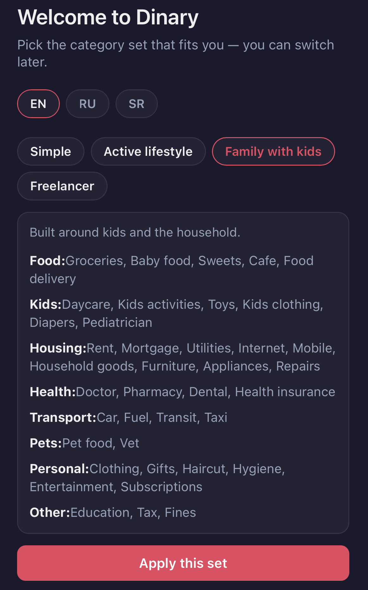
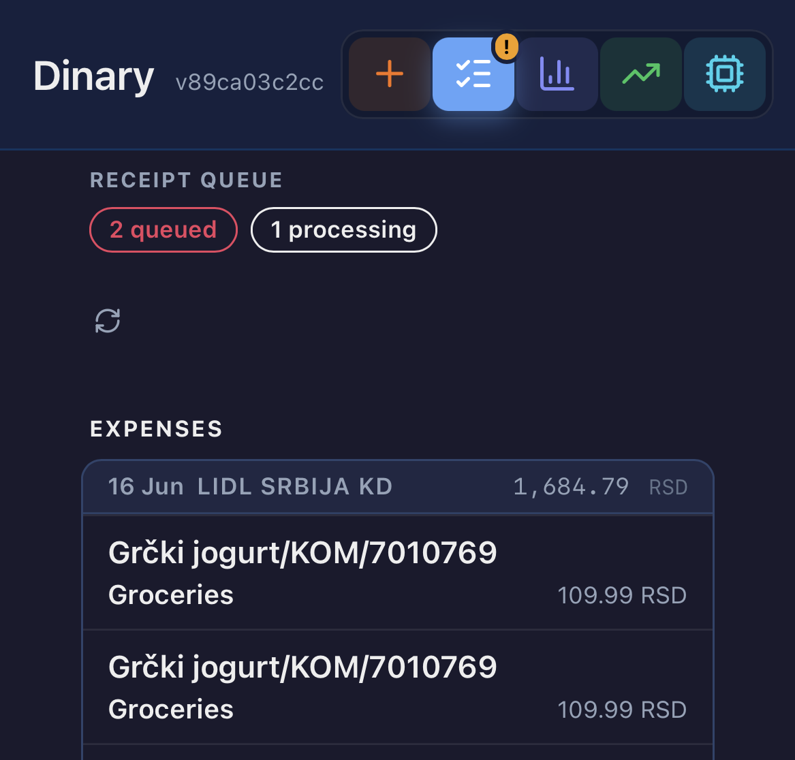
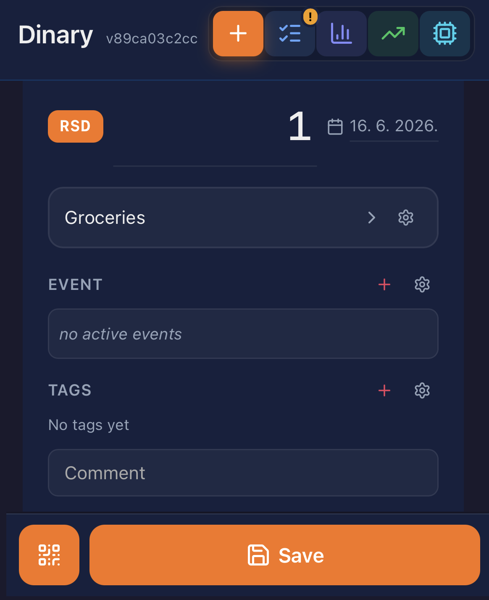

[](https://github.com/andgineer/dinary/actions)
[](https://htmlpreview.github.io/?https://github.com/andgineer/dinary/blob/python-coverage-comment-action-data/htmlcov/index.html)
# Dinary - Your Dinar Diary

Track expenses, scan receipts, analyze spending with AI

<table>
<tr>
<td align="center" valign="top"><sub><b>Pick your category set</b></sub><br/></td>
<td align="center" valign="top"><sub><b>AI Receipt classification</b></sub><br/></td>
<td align="center" valign="top"><sub><b>Quick entry in any currency</b></sub><br/></td>
</tr>
</table>

# Documentation

[Dinary](https://andgineer.github.io/dinary/)

# Development

See [Development](https://andgineer.github.io/dinary/development/) in the docs.

```bash
uv sync
inv dev    # http://127.0.0.1:8000
inv test   # run all tests
inv pre    # pre-commit checks
```

# Deploy to Oracle Cloud

Configure `.deploy/.env` (see `.deploy.example/.env`), then:

```bash
inv setup-server    # one-time: install deps, clone, create systemd services, upload creds
inv deploy --ref=main  # checkout ref, sync deps, restart
inv status --remote # check service status
inv logs --remote   # tail server logs
```

See [Oracle Cloud deployment guide](https://andgineer.github.io/dinary/deploy-oracle/) for details.

## Reports

* [Allure test report](https://andgineer.github.io/dinary/builds/tests/)
* [Codecov](https://app.codecov.io/gh/andgineer/dinary/tree/main/src%2Fdinary)
* [Coveralls](https://coveralls.io/github/andgineer/dinary)

> Created with cookiecutter using [template](https://github.com/andgineer/cookiecutter-python-package)
