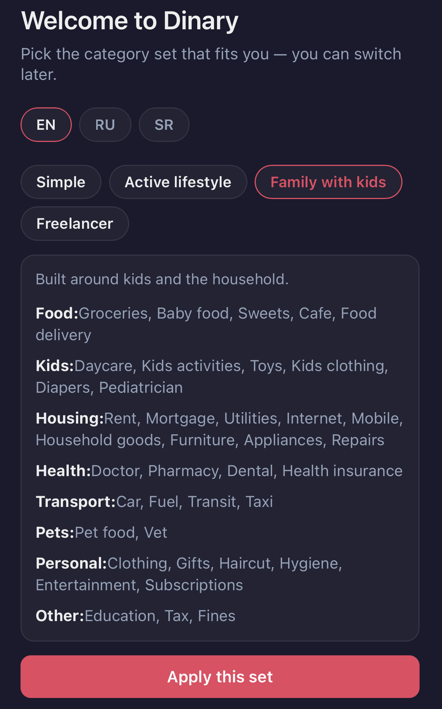
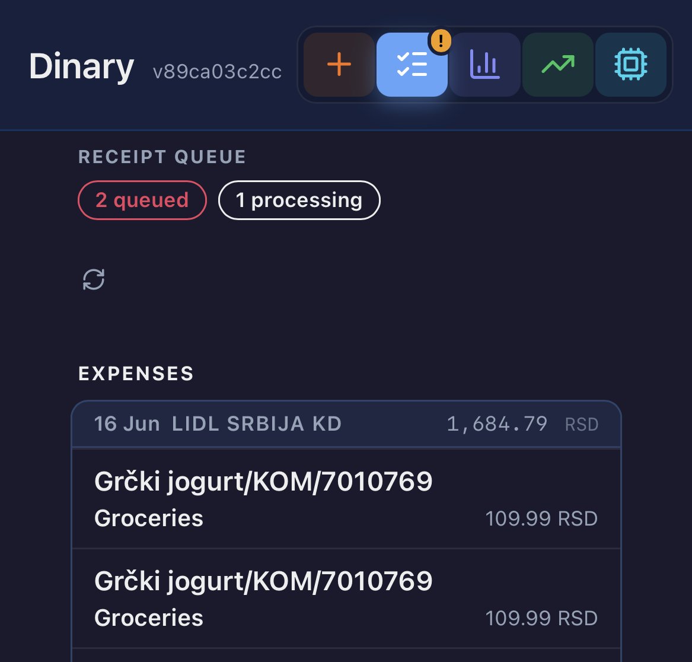
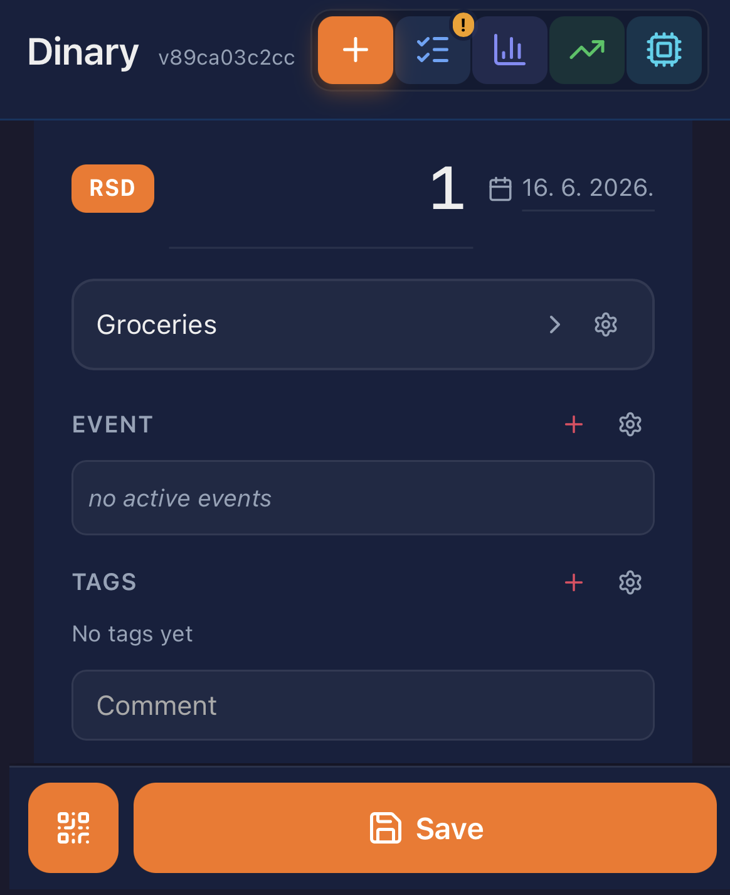

[](https://github.com/andgineer/dinary/actions)
[](https://htmlpreview.github.io/?https://github.com/andgineer/dinary/blob/python-coverage-comment-action-data/htmlcov/index.html)
# Dinary — Your Dinar Diary

**See what went into the shopping bag.**

Scan a fiscal receipt from Serbia or Montenegro and turn its line items into
categorized expenses. Correct a category once and reuse that choice on future
purchases. Track spending across currencies, trips, and tags, with optional
Google Sheets export and AI-assisted analysis.

<table>
<tr>
<td align="center" valign="top"><sub><b>Pick your category set</b></sub><br/></td>
<td align="center" valign="top"><sub><b>Review receipt categories</b></sub><br/><br/></td>
<td align="center" valign="top"><sub><b>Quick entry in any currency</b></sub><br/></td>
</tr>
</table>

* **Know what you bought.** Split a supermarket receipt into item-level spending,
  review uncertain categories, and teach the app your preferences through corrections.
* **Capture it while you remember.** Scan QR codes or enter expenses on your phone,
  including offline. Queued entries sync when the app reconnects.
* **Explore spending your way.** Combine categories, trip or event context, and
  tags. Keep original currencies alongside converted totals, export to Sheets,
  or ask questions in the local analytics dashboard.

[Setup and documentation](https://andgineer.github.io/dinary/) ·
[Install the PWA](https://andgineer.github.io/dinary/pwa-install/) ·
[Analytics](https://andgineer.github.io/dinary/analytics/)

## Under the hood

**Corrections become reusable rules.** Known items use stored classification
rules; unfamiliar or uncertain items go to an LLM. A user correction takes
precedence over the model and applies across branches of the same retail chain.
Classification failures remain recoverable through retries and review.
The [classification design](specs/reference/classification-pipeline.md) explains
confidence, alternatives, and manual resolution.

Provider selection and failover are handled by
[llmbroker](https://github.com/andgineer/llmbroker), a standalone library for
applications that need a pool of LLM providers. Receipt logic stays in Dinary.

**A saved expense outlives a failed network call.** IndexedDB holds offline
entries, and the QR scanner is bundled for offline use. On the server, the
SQLite ledger is the source of truth. Google Sheets export runs through a
retryable queue, so a spreadsheet outage does not prevent expense capture.
See the [offline design](specs/reference/pwa-offline.md) and
[Sheets integration](specs/reference/sheets.md).

**Analysis has a separate home.** The local analytics app uses DuckDB to query a
read-only ledger replica, keeping heavy analytics dependencies off the capture
server. Its AI can query spending and configure views without editing the
ledger. The [analytics design](specs/reference/analytics-ai.md) covers the
dashboard and MCP interface.

### Design decisions

Small, frequent lookups shaped the storage layer. In an early synthetic workload,
5,000 mapping lookups took 2.0 seconds with direct SQL and 19.9 seconds through
Ibis. That comparison led to SQL files and migrations for the transactional
backend. The [architecture record](specs/reference/architecture.md#sql-files-over-ibis)
documents the workload and trade-offs; the result describes that benchmark,
not whole-application performance.

<details>
<summary><b>Contributing</b></summary>

Install uv and Node.js, then prepare the full development and test environment:

```bash
bash scripts/setup-test-env.sh
npm --prefix webapp ci
uv run inv dev --rebuild
```

The setup script installs all Python dependency groups and prepares the tools
needed by analytics and backup tests. See the
[development guide](https://andgineer.github.io/dinary/development/) for local
configuration and platform prerequisites.

```bash
uv run inv pre
uv run pytest
npm --prefix webapp test
```

See [AGENTS.md](AGENTS.md) for repository conventions and the
[deployment guide](https://andgineer.github.io/dinary/deploy-oracle/) for hosting.

[Allure test report](https://andgineer.github.io/dinary/builds/tests/)

</details>
